# DB Schema Audit — Current vs Target

# DB Schema Audit — `init_schema()` vs `docs/TECH_SPEC.md`

**Source of truth (target):** `file:docs/TECH_SPEC.md` §5  
**Implementation under audit:** `file:scripts/backend.py` → `init_schema()` (lines 194–428)  
**Date:** 2026-02-21

---

## 1. Summary Scorecard

| Category | Count |
|---|---|
| Tables to rename | 2 |
| Tables entirely missing | 11 |
| Columns to rename | 14 |
| Columns missing (ADD COLUMN) | 10 |
| Columns extra (not in target, safe to keep) | 6 |
| Indexes missing | 6 |
| Tables fully matching target | 6 |

---

## 2. Table-Level Status

```mermaid
graph TD
    A["users ⚠️ rename → app_users"]
    B["projects ⚠️ column gaps"]
    C["project_storage ❌ missing"]
    D["provider_accounts ❌ missing"]
    E["project_api_secrets ⚠️ column rename"]
    F["style_guides ❌ missing"]
    G["characters ❌ missing"]
    H["reference_sets ❌ missing"]
    I["reference_items ❌ missing"]
    J["assets ⚠️ multiple column gaps"]
    K["asset_links ❌ missing"]
    L["runs ⚠️ column gaps"]
    M["run_jobs ⚠️ column gaps"]
    N["run_job_candidates ⚠️ rename + column gaps"]
    O["quality_reports ❌ missing"]
    P["prompt_templates ❌ missing"]
    Q["cost_events ❌ missing"]
    R["project_exports ⚠️ column gaps"]
    S["audit_events ❌ missing"]
    T["chat_sessions ✅ matches"]
    U["chat_messages ✅ matches"]
    V["agent_instructions ✅ matches + extras"]
    W["agent_instruction_events ✅ matches"]
    X["voice_requests ✅ matches"]
    Y["project_snapshots ➕ extra, not in target"]
```

---

## 3. Detailed Gap Analysis by Table

### 3.1 `users` → `app_users`

**Status:** ⚠️ Table name mismatch — all columns match  
**Action:** Rename table. SQLite requires CREATE + INSERT + DROP pattern (no `RENAME TABLE`).

| Column | Current | Target | Gap |
|---|---|---|---|
| `id` | `TEXT PK` | `UUID PK` | ✅ OK (TEXT stores UUID) |
| `username` | `TEXT UNIQUE NOT NULL` | `TEXT UNIQUE NOT NULL` | ✅ |
| `display_name` | `TEXT NOT NULL` | `TEXT NOT NULL` | ✅ |
| `email` | `TEXT` | `TEXT NULL` | ✅ |
| `is_active` | `INTEGER NOT NULL DEFAULT 1` | `BOOLEAN NOT NULL DEFAULT TRUE` | ✅ |
| `created_at` | `TEXT NOT NULL` | `TIMESTAMPTZ NOT NULL` | ✅ (TEXT stores ISO) |
| `updated_at` | `TEXT NOT NULL` | `TIMESTAMPTZ NOT NULL` | ✅ |

**Downstream impact:** All FKs referencing `users(id)` must be updated in `projects`, `chat_sessions`, `agent_instructions`, `audit_events`.

---

### 3.2 `projects`

**Status:** ⚠️ One column rename, FK target changes

| Column | Current | Target | Gap |
|---|---|---|---|
| `id` | ✅ | ✅ | — |
| `user_id` | `TEXT NOT NULL FK → users(id)` | `owner_user_id UUID NOT NULL FK → app_users.id` | ⚠️ **Rename** `user_id` → `owner_user_id`; FK target → `app_users` |
| `slug` | ✅ | ✅ | — |
| `name` | ✅ | ✅ | — |
| `description` | ✅ | ✅ | — |
| `status` | ✅ | ✅ | — |
| `settings_json` | ✅ | ✅ | — |
| `created_at` | ✅ | ✅ | — |
| `updated_at` | ✅ | ✅ | — |

**Note:** Storage config is currently embedded in `projects.settings_json` (keys `storage.local.*`, `storage.s3.*`). Target spec normalizes this into a separate `project_storage` table. The migration must extract these values and populate the new table.

---

### 3.3 `project_storage` — ❌ MISSING

**Status:** Entirely absent. Storage policy is currently stored as JSON inside `projects.settings_json`.

**All columns to create:**

| Column | Type | Notes |
|---|---|---|
| `id` | `TEXT PK` | |
| `project_id` | `TEXT UNIQUE NOT NULL FK → projects.id` | One row per project |
| `local_base_dir` | `TEXT NOT NULL DEFAULT 'var/projects'` | |
| `local_project_root` | `TEXT NULL` | |
| `s3_enabled` | `INTEGER NOT NULL DEFAULT 0` | |
| `s3_bucket` | `TEXT NULL` | |
| `s3_prefix` | `TEXT NULL` | |
| `s3_region` | `TEXT NULL` | |
| `s3_profile` | `TEXT NULL` | |
| `s3_endpoint_url` | `TEXT NULL` | |
| `created_at` | `TEXT NOT NULL` | |
| `updated_at` | `TEXT NOT NULL` | |

**Migration data step:** For each existing project, read `settings_json.storage` and INSERT a row into `project_storage`. The `resolve_storage_settings()` function in `backend.py` already contains the parsing logic.

---

### 3.4 `provider_accounts` — ❌ MISSING

**Status:** Entirely absent. No equivalent exists in current schema.

**All columns to create:**

| Column | Type | Notes |
|---|---|---|
| `id` | `TEXT PK` | |
| `project_id` | `TEXT NOT NULL FK → projects.id` | |
| `provider_code` | `TEXT NOT NULL` | `openai\|removebg\|photoroom\|local_realesrgan\|...` |
| `is_enabled` | `INTEGER NOT NULL DEFAULT 1` | |
| `config_json` | `TEXT NOT NULL DEFAULT '{}'` | |
| `created_at` | `TEXT NOT NULL` | |
| `updated_at` | `TEXT NOT NULL` | |

**Constraint:** `UNIQUE(project_id, provider_code)`

---

### 3.5 `project_api_secrets`

**Status:** ⚠️ One column rename + nullability change

| Column | Current | Target | Gap |
|---|---|---|---|
| `id` | ✅ | ✅ | — |
| `project_id` | ✅ | ✅ | — |
| `provider_code` | ✅ | ✅ | — |
| `secret_name` | ✅ | ✅ | — |
| `secret_ciphertext` | ✅ | ✅ | — |
| `key_ref TEXT NOT NULL DEFAULT 'local-master'` | present | `kms_key_ref TEXT NULL` | ⚠️ **Rename** `key_ref` → `kms_key_ref`; change to nullable |
| `created_at` | ✅ | ✅ | — |
| `updated_at` | ✅ | ✅ | — |

---

### 3.6 `style_guides` — ❌ MISSING

| Column | Type |
|---|---|
| `id` | `TEXT PK` |
| `project_id` | `TEXT NOT NULL FK → projects.id` |
| `name` | `TEXT NOT NULL` |
| `description` | `TEXT NOT NULL DEFAULT ''` |
| `rules_json` | `TEXT NOT NULL DEFAULT '{}'` |
| `is_default` | `INTEGER NOT NULL DEFAULT 0` |
| `created_at` | `TEXT NOT NULL` |
| `updated_at` | `TEXT NOT NULL` |

---

### 3.7 `characters` — ❌ MISSING

| Column | Type |
|---|---|
| `id` | `TEXT PK` |
| `project_id` | `TEXT NOT NULL FK → projects.id` |
| `code` | `TEXT NOT NULL` (stable short id) |
| `name` | `TEXT NOT NULL` |
| `bio` | `TEXT NOT NULL DEFAULT ''` |
| `identity_constraints_json` | `TEXT NOT NULL DEFAULT '{}'` |
| `created_at` | `TEXT NOT NULL` |
| `updated_at` | `TEXT NOT NULL` |

**Constraint:** `UNIQUE(project_id, code)`

---

### 3.8 `reference_sets` — ❌ MISSING

| Column | Type |
|---|---|
| `id` | `TEXT PK` |
| `project_id` | `TEXT NOT NULL FK → projects.id` |
| `name` | `TEXT NOT NULL` |
| `kind` | `TEXT NOT NULL` (`style\|character\|scene\|lighting\|other`) |
| `metadata_json` | `TEXT NOT NULL DEFAULT '{}'` |
| `created_at` | `TEXT NOT NULL` |
| `updated_at` | `TEXT NOT NULL` |

---

### 3.9 `reference_items` — ❌ MISSING

| Column | Type |
|---|---|
| `id` | `TEXT PK` |
| `reference_set_id` | `TEXT NOT NULL FK → reference_sets.id` |
| `asset_id` | `TEXT NOT NULL FK → assets.id` |
| `weight` | `REAL NOT NULL DEFAULT 1.0` |
| `notes` | `TEXT NOT NULL DEFAULT ''` |
| `created_at` | `TEXT NOT NULL` |

**Constraint:** `UNIQUE(reference_set_id, asset_id)`

---

### 3.10 `assets`

**Status:** ⚠️ Multiple column renames + missing columns + semantic change on path storage

| Column | Current | Target | Gap |
|---|---|---|---|
| `id` | ✅ | ✅ | — |
| `project_id` | ✅ | ✅ | — |
| `asset_kind` | `TEXT NOT NULL` | `kind TEXT NOT NULL` | ⚠️ **Rename** `asset_kind` → `kind` |
| `rel_path` | `TEXT NOT NULL` | `storage_uri TEXT NOT NULL` | ⚠️ **Rename** `rel_path` → `storage_uri` (semantics: now supports `s3://` URIs) |
| *(missing)* | — | `storage_backend TEXT NOT NULL` | ❌ **Add** `storage_backend TEXT NOT NULL DEFAULT 'local'` |
| *(missing)* | — | `mime_type TEXT NULL` | ❌ **Add** `mime_type TEXT NULL` |
| *(missing)* | — | `width INT NULL` | ❌ **Add** `width INTEGER NULL` |
| *(missing)* | — | `height INT NULL` | ❌ **Add** `height INTEGER NULL` |
| `sha256` | ✅ | ✅ | — |
| `meta_json` | `TEXT NOT NULL DEFAULT '{}'` | `metadata_json JSONB NOT NULL DEFAULT '{}'` | ⚠️ **Rename** `meta_json` → `metadata_json` |
| `created_at` | ✅ | ✅ | — |
| `run_id` | present | *(not in target)* | ➕ Extra — safe to keep; target uses `asset_links` instead |
| `job_id` | present | *(not in target)* | ➕ Extra — safe to keep |
| `candidate_id` | present | *(not in target)* | ➕ Extra — safe to keep |

**Unique constraint change:** Current is `UNIQUE(project_id, rel_path)` → must become `UNIQUE(project_id, storage_uri)` after rename.

---

### 3.11 `asset_links` — ❌ MISSING

| Column | Type |
|---|---|
| `id` | `TEXT PK` |
| `project_id` | `TEXT NOT NULL FK → projects.id` |
| `parent_asset_id` | `TEXT NOT NULL FK → assets.id` |
| `child_asset_id` | `TEXT NOT NULL FK → assets.id` |
| `link_type` | `TEXT NOT NULL` (`derived_from\|variant_of\|mask_for\|reference_of`) |
| `created_at` | `TEXT NOT NULL` |

**Constraint:** `UNIQUE(parent_asset_id, child_asset_id, link_type)`

---

### 3.12 `runs`

**Status:** ⚠️ Multiple column renames + missing columns

| Column | Current | Target | Gap |
|---|---|---|---|
| `id` | ✅ | ✅ | — |
| `project_id` | ✅ | ✅ | — |
| `mode` | `TEXT NOT NULL` | `run_mode TEXT NOT NULL` | ⚠️ **Rename** `mode` → `run_mode` |
| `status` | ✅ | ✅ | — |
| `stage` | ✅ | ✅ | — |
| `time_of_day` | ✅ | ✅ | — |
| `weather` | ✅ | ✅ | — |
| `model` | `TEXT` | `model_name TEXT NULL` | ⚠️ **Rename** `model` → `model_name` |
| *(missing)* | — | `provider_code TEXT NULL` | ❌ **Add** `provider_code TEXT NULL` |
| `meta_json` | `TEXT NOT NULL DEFAULT '{}'` | `settings_snapshot_json JSONB NOT NULL DEFAULT '{}'` | ⚠️ **Rename** `meta_json` → `settings_snapshot_json` |
| *(missing)* | — | `started_at TIMESTAMPTZ NULL` | ❌ **Add** `started_at TEXT NULL` |
| *(missing)* | — | `finished_at TIMESTAMPTZ NULL` | ❌ **Add** `finished_at TEXT NULL` |
| `created_at` | ✅ | ✅ | — |
| `run_log_path` | present | *(not in target)* | ➕ Extra — safe to keep for file traceability |
| `image_size` | present | *(not in target)* | ➕ Extra — safe to keep in `settings_snapshot_json` |
| `image_quality` | present | *(not in target)* | ➕ Extra — safe to keep |

---

### 3.13 `run_jobs`

**Status:** ⚠️ Column renames + one missing column

| Column | Current | Target | Gap |
|---|---|---|---|
| `id` | ✅ | ✅ | — |
| `run_id` | ✅ | ✅ | — |
| `job_key` | ✅ | ✅ | — |
| `status` | ✅ | ✅ | — |
| *(missing)* | — | `prompt_text TEXT NOT NULL` | ❌ **Add** `prompt_text TEXT NOT NULL DEFAULT ''` |
| `selected_candidate` | `INTEGER` | `selected_candidate_index INT NULL` | ⚠️ **Rename** `selected_candidate` → `selected_candidate_index` |
| `final_output` | `TEXT` | `final_asset_id UUID NULL FK → assets.id` | ⚠️ **Rename** `final_output` → `final_asset_id`; semantics change to FK |
| `meta_json` | ✅ | ✅ | — |
| `created_at` | ✅ | ✅ | — |

---

### 3.14 `run_job_candidates` → `run_candidates`

**Status:** ⚠️ Table name mismatch + two column renames

| Column | Current | Target | Gap |
|---|---|---|---|
| `id` | ✅ | ✅ | — |
| `job_id` | ✅ | ✅ | — |
| `candidate_index` | ✅ | ✅ | — |
| `status` | ✅ | ✅ | — |
| `output_path` | `TEXT` | `output_asset_id UUID NULL FK → assets.id` | ⚠️ **Rename** `output_path` → `output_asset_id`; semantics change to FK |
| `final_output_path` | `TEXT` | `final_asset_id UUID NULL FK → assets.id` | ⚠️ **Rename** `final_output_path` → `final_asset_id`; semantics change to FK |
| `rank_hard_failures` | ✅ | ✅ | — |
| `rank_soft_warnings` | ✅ | ✅ | — |
| `rank_avg_chroma_exceed` | ✅ | ✅ | — |
| `meta_json` | ✅ | ✅ | — |
| `created_at` | ✅ | ✅ | — |

---

### 3.15 `quality_reports` — ❌ MISSING

| Column | Type |
|---|---|
| `id` | `TEXT PK` |
| `project_id` | `TEXT NOT NULL FK → projects.id` |
| `run_id` | `TEXT NULL FK → runs.id` |
| `job_id` | `TEXT NULL FK → run_jobs.id` |
| `candidate_id` | `TEXT NULL FK → run_candidates.id` |
| `report_type` | `TEXT NOT NULL` (`output_guard\|model_score\|human_review`) |
| `summary_json` | `TEXT NOT NULL DEFAULT '{}'` |
| `created_at` | `TEXT NOT NULL` |

**Note:** QA results currently live only in run log JSON files. Migration step: re-ingest existing run logs to populate this table.

---

### 3.16 `prompt_templates` — ❌ MISSING

| Column | Type |
|---|---|
| `id` | `TEXT PK` |
| `project_id` | `TEXT NOT NULL FK → projects.id` |
| `name` | `TEXT NOT NULL` |
| `stage` | `TEXT NOT NULL` |
| `template_text` | `TEXT NOT NULL` |
| `version` | `INTEGER NOT NULL DEFAULT 1` |
| `is_active` | `INTEGER NOT NULL DEFAULT 1` |
| `created_at` | `TEXT NOT NULL` |

---

### 3.17 `cost_events` — ❌ MISSING

| Column | Type |
|---|---|
| `id` | `TEXT PK` |
| `project_id` | `TEXT NOT NULL FK → projects.id` |
| `run_id` | `TEXT NULL FK → runs.id` |
| `provider_code` | `TEXT NOT NULL` |
| `operation_code` | `TEXT NOT NULL` |
| `units` | `REAL NOT NULL DEFAULT 0` |
| `cost_usd` | `REAL NOT NULL DEFAULT 0` |
| `currency` | `TEXT NOT NULL DEFAULT 'USD'` |
| `meta_json` | `TEXT NOT NULL DEFAULT '{}'` |
| `created_at` | `TEXT NOT NULL` |

---

### 3.18 `project_exports`

**Status:** ⚠️ Two column renames + one missing column

| Column | Current | Target | Gap |
|---|---|---|---|
| `id` | ✅ | ✅ | — |
| `project_id` | ✅ | ✅ | — |
| `export_path` | `TEXT NOT NULL` | `export_asset_id UUID NULL FK → assets.id` | ⚠️ **Rename** `export_path` → `export_asset_id`; semantics change to FK |
| *(missing)* | — | `format TEXT NOT NULL` | ❌ **Add** `format TEXT NOT NULL DEFAULT 'tar.gz'` |
| `export_sha256` | `TEXT` | `sha256 TEXT NULL` | ⚠️ **Rename** `export_sha256` → `sha256` |
| `created_at` | ✅ | ✅ | — |

---

### 3.19 `audit_events` — ❌ MISSING

| Column | Type |
|---|---|
| `id` | `TEXT PK` |
| `project_id` | `TEXT NULL FK → projects.id` |
| `actor_user_id` | `TEXT NULL FK → app_users.id` |
| `event_code` | `TEXT NOT NULL` |
| `payload_json` | `TEXT NOT NULL DEFAULT '{}'` |
| `created_at` | `TEXT NOT NULL` |

---

### 3.20 `chat_sessions` — ✅ Fully matches target

### 3.21 `chat_messages` — ✅ Fully matches target

### 3.22 `agent_instructions` — ✅ Matches target + has extra worker columns

Extra columns added via `ensure_column()` (safe, additive):
- `attempts`, `max_attempts`, `next_attempt_at`, `last_error`, `locked_by`, `locked_at`, `agent_response_json`

These are not in the target spec but are required by the worker. They should be kept.

### 3.23 `agent_instruction_events` — ✅ Fully matches target

### 3.24 `voice_requests` — ✅ Fully matches target

### 3.25 `project_snapshots` — ➕ Extra table, not in target spec

This table exists in the current schema but has no equivalent in `TECH_SPEC.md`. It appears to be a precursor concept. It is safe to keep as-is; it does not conflict with any target table.

---

## 4. Index Gaps

| Index | Current | Target | Gap |
|---|---|---|---|
| `projects(owner_user_id, slug)` | `idx_projects_user` on `(user_id)` | `(owner_user_id, slug)` | ⚠️ Needs update after column rename |
| `runs(project_id, created_at DESC)` | `idx_runs_project` on `(project_id)` only | `(project_id, created_at DESC)` | ⚠️ Needs `created_at` added |
| `run_jobs(run_id, status)` | `idx_jobs_run` on `(run_id)` only | `(run_id, status)` | ⚠️ Needs `status` added |
| `run_candidates(job_id, candidate_index)` | `idx_candidates_job` on `(job_id)` only | `(job_id, candidate_index)` | ⚠️ Needs `candidate_index` added |
| `assets(project_id, kind, created_at DESC)` | `idx_assets_project` on `(project_id)` only | `(project_id, kind, created_at DESC)` | ⚠️ Needs `kind, created_at` added |
| `assets(project_id, sha256)` | *(missing)* | `(project_id, sha256)` | ❌ Missing entirely |
| `cost_events(project_id, created_at DESC)` | *(table missing)* | required | ❌ Table missing |
| `quality_reports(project_id, created_at DESC)` | *(table missing)* | required | ❌ Table missing |

---

## 5. Migration Plan

All migrations must be additive and tracked in `schema_migrations`. SQLite constraints:
- `ALTER TABLE RENAME COLUMN` — supported since SQLite 3.25.0 (2018) ✅
- `ALTER TABLE ADD COLUMN` — always supported ✅
- `ALTER TABLE RENAME TO` — supported, but FKs are not automatically updated ⚠️
- `ALTER TABLE DROP COLUMN` — supported since SQLite 3.35.0 (2021) ✅

### Recommended Migration Sequence

| Migration ID | Description | Type | Risk |
|---|---|---|---|
| `20260221_0001_rename_users` | Rename `users` → `app_users` via CREATE+INSERT+DROP | Table rename | Medium — all FKs must be updated |
| `20260221_0002_projects_owner_col` | Rename `projects.user_id` → `owner_user_id` | Column rename | Low |
| `20260221_0003_project_storage_table` | Create `project_storage`; migrate data from `projects.settings_json` | New table + data migration | Medium |
| `20260221_0004_provider_accounts` | Create `provider_accounts` | New table | Low |
| `20260221_0005_secrets_key_ref` | Rename `project_api_secrets.key_ref` → `kms_key_ref` | Column rename | Low |
| `20260221_0006_creative_knowledge` | Create `style_guides`, `characters`, `reference_sets`, `reference_items` | New tables | Low |
| `20260221_0007_assets_columns` | Rename `asset_kind`→`kind`, `rel_path`→`storage_uri`, `meta_json`→`metadata_json`; add `storage_backend`, `mime_type`, `width`, `height` | Column renames + adds | Medium — unique constraint changes |
| `20260221_0008_asset_links` | Create `asset_links` | New table | Low |
| `20260221_0009_runs_columns` | Rename `mode`→`run_mode`, `model`→`model_name`, `meta_json`→`settings_snapshot_json`; add `provider_code`, `started_at`, `finished_at` | Column renames + adds | Low |
| `20260221_0010_run_jobs_columns` | Rename `selected_candidate`→`selected_candidate_index`, `final_output`→`final_asset_id`; add `prompt_text` | Column renames + add | Low |
| `20260221_0011_rename_candidates` | Rename `run_job_candidates` → `run_candidates`; rename `output_path`→`output_asset_id`, `final_output_path`→`final_asset_id` | Table + column renames | Medium |
| `20260221_0012_quality_reports` | Create `quality_reports` | New table | Low |
| `20260221_0013_prompt_templates` | Create `prompt_templates` | New table | Low |
| `20260221_0014_cost_events` | Create `cost_events` | New table | Low |
| `20260221_0015_project_exports_cols` | Rename `export_path`→`export_asset_id`, `export_sha256`→`sha256`; add `format` | Column renames + add | Low |
| `20260221_0016_audit_events` | Create `audit_events` | New table | Low |
| `20260221_0017_index_updates` | Drop and recreate composite indexes with correct columns | Index updates | Low |

### Data Migration Notes

1. **`project_storage` population:** For each row in `projects`, parse `settings_json` using the same logic as `resolve_storage_settings()` and INSERT into `project_storage`. After migration, the storage resolution code in `backend.py` must be updated to read from the new table.

2. **`quality_reports` backfill:** Existing run log JSON files contain QA guard results per candidate. The `ingest_run()` function must be extended to write `quality_reports` rows during ingestion. Existing runs can be re-ingested to backfill.

3. **`assets` path migration:** `rel_path` values are relative filesystem paths. After rename to `storage_uri`, existing values remain valid as-is. New S3 assets will use `s3://bucket/prefix/...` format. `storage_backend` defaults to `'local'` for all existing rows.

4. **FK path migration (`final_output`, `output_path`, etc.):** These columns currently store file paths (strings). After rename to `*_asset_id`, they should ideally reference `assets.id`. A data migration step must look up the asset by `storage_uri` and replace the path string with the asset UUID. This is a medium-complexity step and can be deferred — the columns can be renamed first and populated lazily on next ingest.

---

## 6. Files Requiring Code Changes After Migration

| File | Change Required |
|---|---|
| `file:scripts/backend.py` | Update `init_schema()`, all SQL queries referencing renamed columns/tables, `upsert_asset()`, `ingest_run()`, `resolve_storage_settings()`, `ensure_project()` |
| `file:scripts/backend_api.py` | Update all SQL queries and response serialization for renamed columns |
| `file:scripts/agent_worker.py` | Update any direct SQL referencing `users` or `projects` columns |
| `file:scripts/db_migrate.py` | Add new migration entries |
| `file:openapi/backend-api.openapi.yaml` | Update response schemas to reflect new column names |

---

## 7. Implementation Progress (2026-02-21)

This section tracks actual implementation status after the initial audit above.

### 7.1 Completed (Schema + Backfill)

Implemented in `scripts/backend.py` (additive compatibility + backfills):

- Canonical user/project ownership compatibility:
  - `app_users` support + read fallbacks
  - `projects.owner_user_id` sync with legacy `user_id`
- Storage normalization support:
  - `project_storage` canonical columns
  - project settings -> `project_storage` sync backfill
- Creative knowledge layer:
  - `style_guides`, `characters`, `reference_sets`, `reference_items`
  - canonical columns (`rules_json`, `identity_constraints_json`, `name`, `kind`, `metadata_json`, `weight`)
- Asset/run canonical compatibility columns:
  - `assets.kind`, `assets.storage_uri`, `assets.metadata_json`, `assets.storage_backend`, `mime_type`, `width`, `height`
  - `runs.run_mode`, `runs.model_name`, `runs.settings_snapshot_json`, `provider_code`, `started_at`, `finished_at`
  - `run_jobs.prompt_text`, `selected_candidate_index`, `final_asset_id`
  - `run_candidates` canonical table + sync from `run_job_candidates`
  - `project_exports.export_asset_id`, `sha256`, `format`
  - `project_api_secrets.kms_key_ref`
- Events/cost/quality canonical columns:
  - `quality_reports.job_id`, `candidate_id`, `report_type`, `summary_json`
  - `cost_events.provider_code`, `operation_code`, `units`, `cost_usd`, `meta_json`
  - `audit_events.actor_user_id`, `event_code`, `payload_json`
- Additional compatibility for provider accounts:
  - `provider_accounts.is_enabled`, `provider_accounts.config_json` + backfill with legacy `meta_json`

Tracked migration markers now include:

- `20260221_0018_phase1_canonical_schema`
- `20260221_0019_phase1_backfill`
- `20260221_0020_phase2_event_columns`
- `20260221_0021_phase2_backfill`
- `20260221_0022_creative_schema_columns`
- `20260221_0023_provider_account_columns`

### 7.2 Completed (API + OpenAPI)

Implemented in `scripts/backend_api.py` and `openapi/backend-api.openapi.yaml`:

- Canonical project listing joins on `app_users`/owner fields
- Runs API (list/detail/jobs with canonical+legacy coalescing)
- Assets API (list/detail with canonical+legacy field compatibility)
- Quality reports and cost events list APIs
- Style guides CRUD
- Characters CRUD
- Reference sets CRUD
- Reference items CRUD
- Provider accounts CRUD (new):
  - `GET /api/projects/{slug}/provider-accounts`
  - `POST /api/projects/{slug}/provider-accounts`
  - `GET /api/projects/{slug}/provider-accounts/{providerCode}`
  - `PUT /api/projects/{slug}/provider-accounts/{providerCode}`
  - `DELETE /api/projects/{slug}/provider-accounts/{providerCode}`
- Prompt templates CRUD (new):
  - `GET /api/projects/{slug}/prompt-templates`
  - `POST /api/projects/{slug}/prompt-templates`
  - `GET /api/projects/{slug}/prompt-templates/{templateId}`
  - `PUT /api/projects/{slug}/prompt-templates/{templateId}`
  - `DELETE /api/projects/{slug}/prompt-templates/{templateId}`
- Asset links CRUD (new):
  - `GET /api/projects/{slug}/asset-links`
  - `POST /api/projects/{slug}/asset-links`
  - `GET /api/projects/{slug}/asset-links/{linkId}`
  - `PUT /api/projects/{slug}/asset-links/{linkId}`
  - `DELETE /api/projects/{slug}/asset-links/{linkId}`
- Project exports read APIs (new):
  - `GET /api/projects/{slug}/exports`
  - `GET /api/projects/{slug}/exports/{exportId}`
- Audit event emission added/extended for mutating project endpoints
- OpenAPI cleanup:
  - fixed duplicate/misplaced `delete` definition under reference item path

### 7.3 Validation Completed

- Python compile checks passed:
  - `python3 -m py_compile scripts/backend.py scripts/backend_api.py`
- OpenAPI YAML parse passed
- API smoke tests passed for:
  - runs/assets/quality/cost reads
  - style guides CRUD
  - characters CRUD
  - reference sets/items CRUD
  - provider accounts CRUD
  - prompt templates CRUD
  - asset links CRUD (integration smoke with seeded assets)
  - exports read APIs (`list` + `detail`) with export creation flow
- Legacy FK normalization/backfill validation passed:
  - `run_job_candidates.output_path/final_output_path` -> `run_candidates.output_asset_id/final_asset_id`
  - `run_jobs.final_output` -> `run_jobs.final_asset_id`
  - `project_exports.export_path` -> `project_exports.export_asset_id`
  - derived `asset_links` seeded from candidate/job asset graph
- Backfill bugfix regression validated:
  - empty-string legacy `run_jobs.final_output` now correctly updates to canonical path during phase3 backfill
- Audit events observed for key mutation flows.

### 7.4 Remaining Work (Current)

Highest-priority remaining deltas versus target spec:

- Optional docs refresh:
  - recalculate top-level scorecard counts in this document to reflect current implementation state.
