# Kroma — Project Spec (Current State & Roadmap)

**Last updated:** 2026-02-27
**Status:** Active development — Rust backend is primary; full Rust app consolidation is in progress (`scripts/` are transitional, not the end state)

---

## 1. What Is Kroma?

Kroma (package: `image-api-tool`) is a **project-first AI image production system** for comics/graphic novels and other long-form visual universes where style and faces must stay stable across many outputs.

It is **not** a GUI app today. It is a **backend-first, CLI-driven system** that orchestrates AI image generation, quality control, and post-processing in a reproducible, cost-safe, project-isolated way.

### Product Philosophy (Aligned)

1. Main goal:
   - create comic/graphic-novel universes with persistent style and character identity.
2. Main unit:
   - `project` is the core unit (one universe/story world with heroes, references, runs, assets, and settings).
   - one user/artist can own multiple projects.
3. Secondary convenience mode:
   - quick utility actions (for example remove background or one-off generation without project setup) are intentionally supported, but they are not the product driver.
4. Future expansion (after image pipeline maturity):
   - continuity-preserving video generation using the same project style/identity foundations.

### Journey Planning Contract

User journey is explicitly planned and tracked in `docs/USER_FLOW_JOURNEY_MAP.md`.

1. `J00-J08` define the primary project-first comic flow.
2. `U01` defines secondary quick utility mode.
3. `Rxx` steps define failure/recovery behavior.
4. New features must map to journey steps before implementation.

### Core Value Propositions

| Value | How it's delivered |
|---|---|
| Style consistency | Staged workflow: style lock → time/light → weather → characters |
| Cost safety | Dry-run mode, `--confirm-spend` guard, batch limits, per-run logs |
| Reproducibility | Every run writes a machine-readable JSON log |
| Quality control | Automated QA guard (chroma/grayscale checks), multi-candidate selection |
| Project isolation | All data, files, and DB records are scoped to a project slug |
| Post-processing | Background removal → upscale → color correction, all in one chain |
| Long-form continuity | Project-centric model keeps story-world style/faces stable across many generations |

### Current State Snapshot (2026-02-22)

1. Rust backend (`src-tauri`) is the primary API/backend implementation.
2. Metadata/database APIs are mostly migrated to Rust and contract-tested.
3. `scripts/` is still required today for the image pipeline, local tool wrappers, and migration utilities.
4. Migration is partial: backend metadata APIs are far ahead of pipeline/runtime migration.
5. Target architecture remains a single Rust-owned application; `scripts/` are a temporary migration layer and should shrink over time.

---

## 2. System Architecture


### Layer Breakdown (Current)

#### Layer 1 — Rust Backend Core (`src-tauri`) — Primary
This is the main backend surface now (`npm run backend:rust`, default `127.0.0.1:8788`).

- Contract-first HTTP surface (`openapi/backend-api.openapi.yaml`)
- Route parity checks + endpoint integration tests
- SQLite schema ownership and migrations at runtime
- Project/storage/asset/runs/chat/instruction/secrets APIs
- Bootstrap prompt export/import (`/bootstrap-prompt`, `/bootstrap-import`)

#### Layer 2 — CLI Pipeline (`scripts/image-lab.mjs`) — Transitional (to be migrated into Rust)
The generation and post-process pipeline is still script-based.

- `dry`/`run` orchestration
- OpenAI image edit calls
- Local post-processing (rembg / Real-ESRGAN / color)
- QA guard and candidate flow

#### Layer 3 — `scripts/` Folder — Transitional only (currently required)
`scripts/` still exists because not all runtime responsibilities are migrated to Rust yet.

It currently contains:
- Active pipeline/runtime scripts (`image-lab.mjs`, tool wrappers)
- Python backend utility scripts (`backend.py`) pending Rust replacement
- Worker/dispatch utilities (`agent_worker.py`, `agent_dispatch.py`)
- Migration/ops helpers (`db_migrate.py`, `contract_smoke.py`, setup scripts)

### Why `scripts/` still exists

Short answer: **partial migration**.

1. Rust now owns most backend data/API functionality.
2. Generation orchestration + local media toolchain is still Node/Python script-driven.
3. Some Python commands are still present while runtime modules are being moved into Rust.

This is a transition state, not the intended product architecture.

The intended end state is:

1. Rust owns API + DB + migrations + pipeline orchestration + workers + ingest/QA/cost logging.
2. External tools/APIs are invoked through Rust modules/adapters (not ad-hoc scripts).
3. `scripts/` is reduced to migration shims / dev utilities and then removed from the core runtime path.

So no, it is not all migrated to Rust yet, and yes, the roadmap should continue pushing toward a single app.

---

## 3. File Structure

```text
app/
├── src-tauri/                 # Rust backend core (primary API)
│   ├── src/
│   │   ├── api/
│   │   ├── db/
│   │   └── contract/
│   └── tests/
├── scripts/                   # Transitional + pipeline runtime scripts
│   ├── image-lab.mjs
│   ├── backend.py
│   ├── agent_worker.py
│   ├── agent_dispatch.py
│   ├── db_migrate.py
│   ├── output-guard.py
│   └── setup_tools.py
├── settings/                  # Pipeline prompt/preset/postprocess configuration
├── openapi/
│   └── backend-api.openapi.yaml
├── var/                       # Runtime state (not versioned)
│   ├── backend/
│   └── projects/
├── tools/                     # Local tool runtime dirs (not versioned)
└── docs/
```

---

## 4. Creative Pipeline (Staged Workflow)

```mermaid
flowchart TD
    A["Stage 1: Style Lock\nConsistent artistic hand\nGeometry preserved"] --> B["Stage 2: Time/Light Lock\nDay/night variation\nStyle stays stable"]
    B --> C["Stage 3: Weather/Effects\nRain, clear, etc.\nNever replaces structure"]
    C --> D["Stage 4+: Characters\nOnly after scene style is locked"]
    D --> E["Post-Processing Chain\nbg_remove → upscale → color"]
    E --> F["QA Guard\nChroma/grayscale check\nAuto-archive bad outputs"]
    F --> G["DB Ingest\nRun log → SQLite backend"]
```



### Post-Processing Chain (fixed order)

1. `rembg` — local background removal (free, fast)
2. OpenAI refine pass — edge cleanup for hair/transparency
3. Real-ESRGAN — local upscaling (2x or 4x)
4. Color correction — profile-based (neutral / cinematic_warm / cold_rain)

### Multi-Candidate Selection

- Request N candidates per scene (`--candidates N`, max 6 by default)
- QA guard runs on each candidate
- Best candidate selected by: fewer hard failures → fewer soft warnings → lower avg chroma exceed
- All candidates and the selected winner are stored in the run log and DB

---

## 5. Configuration System

### `settings/manifest.json`
Single source of truth for a run:

| Key | Purpose |
|---|---|
| `style_refs` | Style anchor image paths |
| `scene_refs` | Input scene image paths |
| `safe_batch_limit` | Max jobs per run (default: 20) |
| `generation.max_candidates` | Hard cap on candidates (default: 6) |
| `output_guard` | Grayscale enforcement + chroma thresholds |
| `policy.allowed_style_roots` | Prevents style-anchor contamination |
| `prompts.*` | All prompt text lives here, not in code |

### `settings/postprocess.json`
Controls upscale, bg-remove, and color correction backends and parameters.

### `settings/color-correction.json`
Named color profiles: `neutral`, `cinematic_warm`, `cold_rain`.

---

## 6. Database — Current vs Target Schema

The primary schema is now owned by Rust (`src-tauri/src/db/projects.rs` + submodules).
Tables are created/normalized on startup by the Rust backend.

### Current Tables (implemented in Rust backend)

| Table | Status | Notes |
|---|---|---|
| `users` | ✅ Present | Migration holdover (planned removal) |
| `app_users` | ✅ Present | New canonical user table |
| `projects` | ✅ Present | Project metadata |
| `project_storage` | ✅ Present | Local + S3 storage policy |
| `runs` / `run_jobs` | ✅ Present | Run/job tracking |
| `run_job_candidates` | ✅ Present | Migration holdover (planned removal) |
| `run_candidates` | ✅ Present | Ranked candidate model |
| `assets` | ✅ Present | Asset registry |
| `asset_links` | ✅ Present | Derived/reference relationships |
| `provider_accounts` | ✅ Present | Per-project provider config |
| `style_guides` | ✅ Present | Style lock definitions |
| `characters` | ✅ Present | Character profiles |
| `reference_sets` / `reference_set_items` | ✅ Present | Reference pack system |
| `prompt_templates` | ✅ Present | Prompt templates |
| `quality_reports` | ✅ Present | QA report rows |
| `cost_events` | ✅ Present | Cost tracking events |
| `project_exports` | ✅ Present | Export metadata |
| `chat_sessions` / `chat_messages` | ✅ Present | Chat history |
| `agent_instructions` / `agent_instruction_events` | ✅ Present | Instruction lifecycle |
| `project_secrets` | ✅ Present | Project secret storage |

### Remaining Gaps / Cleanup

| Item | Status | Notes |
|---|---|---|
| `audit_events` table | ❌ Missing | Still pending |
| Table cleanup (`users`, `run_job_candidates`) | ⚠️ Pending | Migration holdovers scheduled for removal |
| Full data migration off Python-only paths | ⚠️ In progress | Rust is primary, scripts still exist for pipeline/tooling |

---

## 7. REST API Surface

Primary Base URL: `http://127.0.0.1:8788`
Contract: `file:openapi/backend-api.openapi.yaml`

### Implemented Endpoints

| Group | Endpoints |
|---|---|
| Health | `GET /health` |
| Projects | `GET/POST /api/projects`, `GET /api/projects/:slug` |
| Bootstrap | `GET /api/projects/:slug/bootstrap-prompt`, `POST /api/projects/:slug/bootstrap-import` (`merge`/`replace` + `dry_run`) |
| Storage | `GET /api/projects/:slug/storage`, `PUT .../local`, `PUT .../s3` |
| Runs | `GET /api/projects/:slug/runs`, `GET .../runs/:runId`, `GET .../runs/:runId/jobs` |
| Assets | `GET /api/projects/:slug/assets`, `GET .../assets/:assetId`, asset link CRUD |
| Analytics | `GET /api/projects/:slug/quality-reports`, `GET .../cost-events` |
| Exports | `GET /api/projects/:slug/exports`, `GET .../exports/:exportId` |
| Prompt Templates | Full CRUD |
| Provider Accounts | Full CRUD |
| Style Guides | Full CRUD |
| Characters | Full CRUD |
| Reference Sets | Set CRUD + item CRUD |
| Chat | Session CRUD-lite + message create/list |
| Agent | Instruction create/list/detail/events/confirm/cancel |
| Secrets | `GET/POST .../secrets`, `DELETE .../secrets/:provider/:name` |

### Missing / Planned Endpoints

| Group | Missing |
|---|---|
| Auth | `POST /auth/login`, `POST /auth/token` |
| Pipeline execution APIs | Run trigger/ingest parity from script pipeline into Rust API |
| Export mutation APIs | Rust-side create export / sync-s3 path completion |
| Worker migration | Move instruction worker runtime from Python script to Rust service/module |

---

## 8. Agent Instruction System


### Instruction Payload Contract

Every instruction dispatched to an external agent API must include:

| Field | Type | Description |
|---|---|---|
| `instruction_id` | UUID | Stable identifier |
| `project_slug` | TEXT | Project scope |
| `instruction_type` | TEXT | `pipeline_run\|asset_edit\|qa_check\|storage_sync\|custom` |
| `objective` | TEXT | Plain-language goal |
| `constraints` | object | Hard limits and rules |
| `inputs` | object | Paths / asset IDs / references |
| `execution` | object | Model / provider / options |
| `confirmation_required` | boolean | Whether user must confirm before execution |
| `requested_by` | TEXT | User ID or username |
| `callback` | object | Status/event endpoint for agent to report back |

### Worker Configuration

| Parameter | Default | Description |
|---|---|---|
| `--poll-interval-seconds` | 2.0 | DB polling frequency |
| `--max-locked-seconds` | 120 | Stale lock timeout |
| `--default-max-attempts` | 3 | Retry limit per instruction |
| `--retry-backoff-seconds` | 10 | Base backoff multiplier |
| `--dispatch-timeout` | 20.0 | HTTP timeout per attempt |
| `--dispatch-retries` | 2 | HTTP-level retries |

---

## 9. External Integrations

| Integration | Purpose | Required | Config |
|---|---|---|---|
| OpenAI `gpt-image-1` | Image generation & editing | Yes (for `run` mode) | `OPENAI_API_KEY` in `.env` |
| OpenAI (bg refine) | Edge cleanup on cutouts | Optional | Same key |
| rembg (Python) | Local background removal | Optional | `tools/rembg/.venv` |
| Real-ESRGAN (Python) | Local upscaling | Optional | `tools/realesrgan-python/.venv` |
| Real-ESRGAN (ncnn) | Fallback upscaling binary | Optional | `tools/realesrgan/` |
| PhotoRoom API | Paid BG removal fallback | Optional | `PHOTOROOM_API_KEY` |
| remove.bg API | Paid BG removal fallback | Optional | `REMOVE_BG_API_KEY` |
| AWS CLI / S3 | Project file sync | Optional | AWS profile or env vars |
| External Agent API | Receives instruction payloads | Optional | `IAT_AGENT_API_URL` + `IAT_AGENT_API_TOKEN` |

---

## 10. What Needs to Be Built — Roadmap

### Phase 1 — Stabilize & Complete Backend (Current Priority)

This phase is not only about CRUD endpoints. It also includes consolidating runtime behavior into the Rust application so Kroma becomes a single app rather than a Rust backend plus script runtime.

#### 10.0 Runtime Consolidation Into Rust (High Priority)

Current state: API/data layers are mostly in Rust, but generation/runtime orchestration still depends on `scripts/`.

Priority work:

1. Replace `scripts/image-lab.mjs` orchestration with a Rust pipeline orchestration module
2. Move run trigger / ingest parity paths into Rust endpoints + services
3. Replace Python worker runtime (`agent_worker.py` / `agent_dispatch.py`) with Rust worker/service modules
4. Build Rust adapters for external tools/integrations (OpenAI image calls, rembg, ESRGAN, S3 sync) behind typed interfaces
5. Add parity tests for Rust runtime paths before deprecating script paths
6. Define script deprecation milestones (feature flag -> default Rust path -> removal)

#### 10.1 DB Schema Migration to Target Spec

Most target schema items are now present in Rust. Current DB priorities are:

1. Add missing `audit_events`
2. Remove migration-holdover tables (`users`, `run_job_candidates`) once Rust-owned replacements are fully authoritative
3. Keep migrations additive and forward-safe while script runtime paths are still being replaced

#### 10.2 Missing API Endpoints

Most metadata CRUD/read endpoints are implemented in Rust. Remaining API priorities:

1. Auth/token endpoints (`/auth/*`)
2. Pipeline execution mutation parity (trigger/ingest)
3. Export mutation parity (`create export`, `sync-s3`)
4. Preview-first UX support expansion around bootstrap import flows

Note: endpoint completion alone is not sufficient; runtime execution must also move into Rust for full application consolidation (see 10.0).

#### 10.3 Cost Tracking

Cost event read API exists. Remaining work:

1. Ensure all generation paths emit normalized `cost_events`
2. Add richer provider/model attribution fields where missing
3. Add dashboard-facing aggregation endpoints when frontend needs stabilize

#### 10.4 Quality Reports Normalization

Quality report table and read API exist. Remaining work:

1. Backfill historical run logs where practical
2. Standardize candidate linkage for all ingest paths
3. Expand report detail shape for frontend QA drill-down views

---

### Phase 2 — GUI Frontend

No GUI exists today. The backend-first approach is intentional, but a GUI is the next major milestone.
Frontend scope is project-first for comic/graphic-novel production continuity.

#### Proposed Frontend Stack

- **Framework:** React (or SvelteKit for lighter footprint)
- **API:** Consumes the Rust REST API at `http://127.0.0.1:8788`
- **Hosting:** Local dev server (same machine as backend)

#### Required Views

| View | Description |
|---|---|
| Project Dashboard | List projects, create new, view status |
| Project Universe Overview | Story metadata, cast continuity anchors, style lock status |
| Run Viewer | Browse runs, jobs, candidates with thumbnails |
| Asset Browser | Browse all assets by kind, filter, preview |
| Chat / Copilot | Text chat interface, send messages, view agent instructions |
| Instruction Queue | View queued/running/done instructions, confirm/cancel |
| Settings | Project storage config, secrets management |
| QA Report | Per-run quality report with pass/fail breakdown |
| Quick Utility Lab (Secondary) | Fast one-off tools (bg-remove / one-off generate) outside project setup |

#### Project Dashboard Wireframe

```wireframe
<!DOCTYPE html>
<html>
<head>
<style>
* { box-sizing: border-box; margin: 0; padding: 0; font-family: sans-serif; }
body { background: #f5f5f5; color: #222; }
.topbar { background: #1a1a1a; color: #fff; padding: 12px 24px; display: flex; align-items: center; gap: 16px; }
.topbar .logo { font-weight: 700; font-size: 18px; letter-spacing: 1px; }
.topbar .nav { display: flex; gap: 16px; font-size: 13px; color: #aaa; }
.topbar .nav span { cursor: pointer; }
.topbar .nav span.active { color: #fff; }
.main { display: flex; height: calc(100vh - 48px); }
.sidebar { width: 220px; background: #fff; border-right: 1px solid #e0e0e0; padding: 16px; }
.sidebar h3 { font-size: 11px; text-transform: uppercase; color: #888; margin-bottom: 12px; letter-spacing: 1px; }
.sidebar .proj-item { padding: 8px 10px; border-radius: 6px; font-size: 13px; cursor: pointer; margin-bottom: 4px; }
.sidebar .proj-item.active { background: #f0f0f0; font-weight: 600; }
.sidebar .proj-item .badge { float: right; font-size: 10px; background: #e0e0e0; border-radius: 10px; padding: 1px 6px; }
.sidebar .new-btn { margin-top: 16px; width: 100%; padding: 8px; background: #1a1a1a; color: #fff; border: none; border-radius: 6px; font-size: 13px; cursor: pointer; }
.content { flex: 1; padding: 24px; overflow-y: auto; }
.content h2 { font-size: 20px; margin-bottom: 4px; }
.content .sub { font-size: 13px; color: #888; margin-bottom: 24px; }
.stats { display: flex; gap: 16px; margin-bottom: 24px; }
.stat-card { background: #fff; border: 1px solid #e0e0e0; border-radius: 8px; padding: 16px 20px; flex: 1; }
.stat-card .label { font-size: 11px; color: #888; text-transform: uppercase; letter-spacing: 1px; }
.stat-card .value { font-size: 28px; font-weight: 700; margin-top: 4px; }
.section-title { font-size: 13px; font-weight: 600; text-transform: uppercase; color: #888; letter-spacing: 1px; margin-bottom: 12px; }
.run-table { background: #fff; border: 1px solid #e0e0e0; border-radius: 8px; overflow: hidden; }
.run-table table { width: 100%; border-collapse: collapse; font-size: 13px; }
.run-table th { background: #f8f8f8; padding: 10px 16px; text-align: left; font-weight: 600; color: #555; border-bottom: 1px solid #e0e0e0; }
.run-table td { padding: 10px 16px; border-bottom: 1px solid #f0f0f0; }
.run-table tr:last-child td { border-bottom: none; }
.badge-done { background: #d4edda; color: #155724; border-radius: 10px; padding: 2px 8px; font-size: 11px; }
.badge-running { background: #fff3cd; color: #856404; border-radius: 10px; padding: 2px 8px; font-size: 11px; }
.badge-failed { background: #f8d7da; color: #721c24; border-radius: 10px; padding: 2px 8px; font-size: 11px; }
.actions { display: flex; gap: 8px; margin-bottom: 20px; }
.btn { padding: 8px 16px; border-radius: 6px; font-size: 13px; cursor: pointer; border: 1px solid #ccc; background: #fff; }
.btn-primary { background: #1a1a1a; color: #fff; border-color: #1a1a1a; }
</style>
</head>
<body>
<div class="topbar">
  <div class="logo">KROMA</div>
  <div class="nav">
    <span class="active">Projects</span>
    <span>Assets</span>
    <span>Settings</span>
  </div>
</div>
<div class="main">
  <div class="sidebar">
    <h3>Projects</h3>
    <div class="proj-item active">eugenia_prod <span class="badge">12</span></div>
    <div class="proj-item">noir_city <span class="badge">5</span></div>
    <div class="proj-item">demo</div>
    <button class="new-btn">+ New Project</button>
  </div>
  <div class="content">
    <h2>eugenia_prod</h2>
    <div class="sub">Local storage · Last run 2h ago</div>
    <div class="stats">
      <div class="stat-card"><div class="label">Total Runs</div><div class="value">12</div></div>
      <div class="stat-card"><div class="label">Assets</div><div class="value">84</div></div>
      <div class="stat-card"><div class="label">Cost (USD)</div><div class="value">$4.20</div></div>
      <div class="stat-card"><div class="label">QA Pass Rate</div><div class="value">91%</div></div>
    </div>
    <div class="actions">
      <button class="btn btn-primary" data-element-id="btn-new-run">+ New Run</button>
      <button class="btn" data-element-id="btn-open-chat">💬 Copilot</button>
      <button class="btn" data-element-id="btn-export">Export</button>
    </div>
    <div class="section-title">Recent Runs</div>
    <div class="run-table">
      <table>
        <thead><tr><th>Run ID</th><th>Stage</th><th>Jobs</th><th>Status</th><th>Started</th></tr></thead>
        <tbody>
          <tr><td>run_2026-02-21...</td><td>style</td><td>6/6</td><td><span class="badge-done">done</span></td><td>2h ago</td></tr>
          <tr><td>run_2026-02-20...</td><td>time</td><td>6/6</td><td><span class="badge-done">done</span></td><td>1d ago</td></tr>
          <tr><td>run_2026-02-19...</td><td>weather</td><td>4/6</td><td><span class="badge-failed">partial</span></td><td>2d ago</td></tr>
          <tr><td>run_2026-02-18...</td><td>style</td><td>6/6</td><td><span class="badge-running">running</span></td><td>3d ago</td></tr>
        </tbody>
      </table>
    </div>
  </div>
</div>
</body>
</html>
```

#### Chat / Copilot View Wireframe

```wireframe
<!DOCTYPE html>
<html>
<head>
<style>
* { box-sizing: border-box; margin: 0; padding: 0; font-family: sans-serif; }
body { background: #f5f5f5; color: #222; height: 100vh; display: flex; flex-direction: column; }
.topbar { background: #1a1a1a; color: #fff; padding: 12px 24px; display: flex; align-items: center; gap: 16px; font-size: 14px; }
.topbar .logo { font-weight: 700; font-size: 16px; }
.topbar .breadcrumb { color: #aaa; font-size: 13px; }
.chat-layout { display: flex; flex: 1; overflow: hidden; }
.sessions-panel { width: 220px; background: #fff; border-right: 1px solid #e0e0e0; padding: 16px; overflow-y: auto; }
.sessions-panel h3 { font-size: 11px; text-transform: uppercase; color: #888; margin-bottom: 12px; letter-spacing: 1px; }
.session-item { padding: 8px 10px; border-radius: 6px; font-size: 13px; cursor: pointer; margin-bottom: 4px; }
.session-item.active { background: #f0f0f0; font-weight: 600; }
.session-item .date { font-size: 11px; color: #aaa; }
.new-session-btn { width: 100%; padding: 8px; background: #1a1a1a; color: #fff; border: none; border-radius: 6px; font-size: 13px; cursor: pointer; margin-bottom: 16px; }
.chat-main { flex: 1; display: flex; flex-direction: column; }
.messages { flex: 1; overflow-y: auto; padding: 24px; display: flex; flex-direction: column; gap: 16px; }
.msg { max-width: 70%; }
.msg.user { align-self: flex-end; }
.msg.assistant { align-self: flex-start; }
.msg .bubble { padding: 10px 14px; border-radius: 12px; font-size: 14px; line-height: 1.5; }
.msg.user .bubble { background: #1a1a1a; color: #fff; border-bottom-right-radius: 4px; }
.msg.assistant .bubble { background: #fff; border: 1px solid #e0e0e0; border-bottom-left-radius: 4px; }
.msg .meta { font-size: 11px; color: #aaa; margin-top: 4px; }
.msg.user .meta { text-align: right; }
.instruction-card { background: #fff8e1; border: 1px solid #ffe082; border-radius: 8px; padding: 12px 14px; font-size: 13px; margin-top: 8px; }
.instruction-card .label { font-size: 11px; text-transform: uppercase; color: #888; margin-bottom: 4px; }
.instruction-card .actions { display: flex; gap: 8px; margin-top: 10px; }
.instruction-card .btn { padding: 5px 12px; border-radius: 5px; font-size: 12px; cursor: pointer; border: 1px solid #ccc; background: #fff; }
.instruction-card .btn-confirm { background: #1a1a1a; color: #fff; border-color: #1a1a1a; }
.input-bar { padding: 16px 24px; background: #fff; border-top: 1px solid #e0e0e0; display: flex; gap: 10px; align-items: flex-end; }
.input-bar textarea { flex: 1; padding: 10px 14px; border: 1px solid #ccc; border-radius: 8px; font-size: 14px; resize: none; height: 44px; }
.input-bar .mic-btn { padding: 10px 14px; background: #f0f0f0; border: 1px solid #ccc; border-radius: 8px; cursor: pointer; font-size: 16px; }
.input-bar .send-btn { padding: 10px 20px; background: #1a1a1a; color: #fff; border: none; border-radius: 8px; font-size: 14px; cursor: pointer; }
</style>
</head>
<body>
<div class="topbar">
  <div class="logo">KROMA</div>
  <div class="breadcrumb">eugenia_prod › Copilot</div>
</div>
<div class="chat-layout">
  <div class="sessions-panel">
    <button class="new-session-btn" data-element-id="btn-new-session">+ New Session</button>
    <h3>Sessions</h3>
    <div class="session-item active">Scene planning<div class="date">Today</div></div>
    <div class="session-item">Style review<div class="date">Yesterday</div></div>
    <div class="session-item">Weather pass<div class="date">Feb 19</div></div>
  </div>
  <div class="chat-main">
    <div class="messages">
      <div class="msg user">
        <div class="bubble">Run a style lock pass on all 6 scenes with 3 candidates each.</div>
        <div class="meta">You · 14:32</div>
      </div>
      <div class="msg assistant">
        <div class="bubble">
          I'll queue a pipeline run for stage=style with candidates=3 across all 6 scenes. This will cost approximately $1.80. Shall I proceed?
          <div class="instruction-card">
            <div class="label">Agent Instruction · pipeline_run</div>
            <strong>Stage:</strong> style · <strong>Candidates:</strong> 3 · <strong>Scenes:</strong> 6<br>
            <strong>Status:</strong> Awaiting confirmation
            <div class="actions">
              <button class="btn btn-confirm" data-element-id="btn-confirm-instruction">Confirm</button>
              <button class="btn" data-element-id="btn-cancel-instruction">Cancel</button>
            </div>
          </div>
        </div>
        <div class="meta">Kroma Copilot · 14:32</div>
      </div>
    </div>
    <div class="input-bar">
      <textarea placeholder="Ask Kroma to run a pipeline, check quality, manage assets..." data-element-id="chat-input"></textarea>
      <button class="send-btn" data-element-id="btn-send">Send</button>
    </div>
  </div>
</div>
</body>
</html>
```

---

### Phase 2 — Authentication

Currently the system runs in single-user mode with a hardcoded `local` user. Auth is a Phase 2 concern.

#### Required Work

1. Add `api_tokens` table (hashed tokens, scoped to user + project)
2. Add `Authorization: Bearer <token>` check to all API endpoints
3. Add `POST /auth/token` endpoint (generate token for local user)
4. Add token rotation and expiry
5. Keep single-user bootstrap path (`--with-default-user`) working without auth for local dev

---

### Phase 2 — Advanced Scoring & Consistency Metrics

1. Add model-based scoring for candidate ranking (beyond chroma/grayscale)
2. Add character consistency scoring (face/pose similarity across scenes)
3. Add style drift detection (compare output style to reference set)
4. Expose scoring results via `quality_reports` table

---

### Phase 3 — Continuity Video (Future)

1. Extend project style/identity continuity from still images to shot sequences.
2. Add clip-level continuity checks (face/style drift between adjacent shots).
3. Reuse project reference/style constraints as conditioning inputs for video generation.
4. Keep video outputs project-scoped with the same reproducibility/audit requirements.

---

## 11. Security & Secret Handling

| Rule | Implementation |
|---|---|
| API keys never stored in plaintext | Fernet symmetric encryption in `project_api_secrets` |
| Master key from env or file | `IAT_MASTER_KEY` env var or `IAT_MASTER_KEY_FILE` path |
| Secrets masked in API responses | `list-project-secrets` returns masked values only |
| Run logs never print secret values | Enforced in `backend.py` ingest path |
| S3 sync operations are auditable | `audit_events` table (target schema) |

---

## 12. MVP Delivery Checklist

### Phase 1 (Current)

- [ ] DB schema migration to target spec (12 tables to add/rename)
- [ ] `quality_reports` table + ingest from run logs
- [ ] `cost_events` table + ingest from run logs
- [ ] Missing REST endpoints (runs, assets, quality, cost, characters)
- [ ] OpenAPI spec updated to match all implemented endpoints
- [ ] Contract smoke test coverage for all endpoints

### Phase 2

- [ ] Frontend GUI (React/Svelte) — project dashboard, run viewer, chat, asset browser
- [ ] Authentication (API tokens, single-user bootstrap)
- [ ] Voice STT/TTS pipeline (OpenAI Whisper + TTS)
- [ ] Advanced scoring models for candidate ranking
- [ ] Character consistency metrics
- [ ] PostgreSQL migration path (from SQLite)

### Phase 3+ (Future)

- [ ] Continuity-preserving video generation with project character/style identity
- [ ] Shot-sequence consistency metrics and review workflow

---

## 13. Key Design Principles

1. **Prompts are data** — no hardcoded project text in scripts; all prompts live in `settings/manifest.json`
2. **Dry-run first** — every new prompt pack must be tested in dry mode before spending
3. **Project isolation** — all data, files, and DB records are scoped to a project slug; no cross-project references
4. **Reproducibility** — every run writes a complete JSON log; runs can be replayed
5. **Additive migrations only** — DB schema changes must never destroy existing data
6. **Backend-first** — API is the source of truth; GUI is a consumer, not the owner
