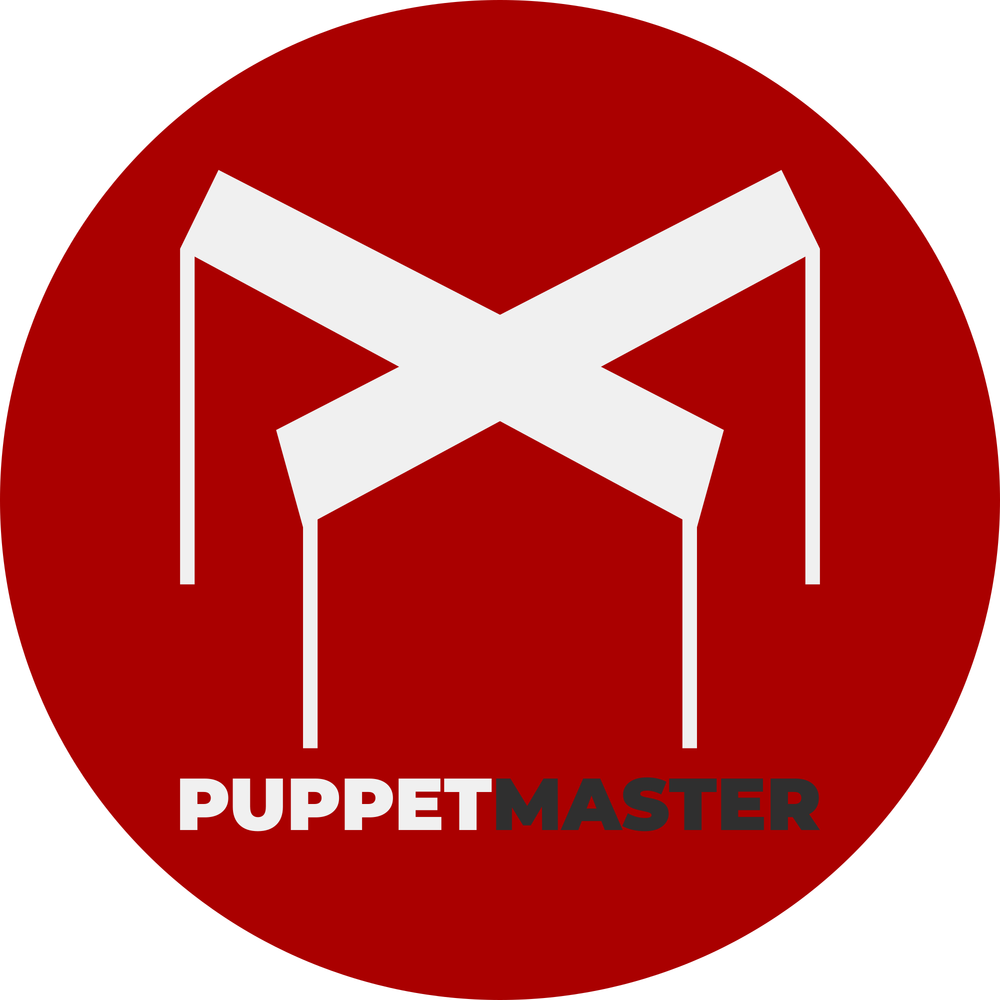

<div align="center"></div>

<p align="center">
  <a href="#license--contact"></a>
  <a href="./docs/releases/1.2.1.md"></a>
  <a href="https://github.com/ldco/PuppetMaster2/actions/workflows/ci.yml"></a>
  <a href="https://www.typescriptlang.org/"></a>
</p>

# Puppet Master Framework

Config-driven Nuxt 4 framework for building production websites/apps with a role-based admin panel.

## Introduction

Puppet Master solves a common problem: teams want fast delivery without losing architectural consistency.

It is for developers who need a configurable framework with strict conventions for CSS, component structure, API validation, and RBAC.

It exists to make project setup, feature delivery, and framework-level upgrades predictable across contributors and releases.

## Features

- Config-first architecture in `app/puppet-master.config.ts`
- Nuxt 4 + Vue 3 + TypeScript + Nitro/H3 stack
- Drizzle ORM + SQLite default data layer
- Zod-validated API routes and role-based admin APIs
- Global layered CSS system (reset, primitives, semantic, components, utilities)
- Built-in modules (`blog`, `portfolio`, `pricing`, `team`, `faq`, `contact`, and more)
- Local bootstrap workspace for React Native/Expo in `pm-native/`

## 🚀 Quick Start

### Prerequisites

Why: matching runtime versions avoids setup failures and native module rebuild issues.

- Node.js `20.x` (CI uses Node 20)
- npm `10+`
- Git

### Installation

Why: install dependencies once at repository root before running setup scripts.

```bash
git clone https://github.com/ldco/PuppetMaster2.git
cd PuppetMaster2
npm install
```

### Environment Setup

Why: runtime settings are loaded from `.env`; the template already contains safe local defaults.

```bash
cp .env.example .env
```

Minimal local `.env` values (from `.env.example`):

```env
SITE_DOMAIN=example.com
DATABASE_URL=./data/sqlite.db
```

### Run Locally

Why: this golden path configures the framework for local development, creates DB schema, and seeds sample users.

```bash
npm run init -- --headless --mode=develop
npm run dev
```

### ✅ Success Check

You should now see the app at `http://localhost:3000`.

Optional health check:

```bash
curl http://localhost:3000/api/health
```

You should get JSON containing a `status` field (typically `"ok"`).

Seeded local accounts after `--mode=develop`:

- `master@example.com` / `master123`
- `admin@example.com` / `admin123`
- `editor@example.com` / `editor123`

## Usage

### CLI Examples

```bash
npm run workflow:info
npm run test:run
npm run build
```

### API Example

```bash
curl -X GET http://localhost:3000/api/health
```

### App Code Example (Nuxt)

```ts
const health = await $fetch('/api/health')
console.log(health.status)
```

## Configuration

Why: these are the environment keys most likely to affect local runs and integrations.

| Key | Description | Default | Required |
| --- | --- | --- | --- |
| `PM_MODE` | Setup mode override (`unconfigured`, `build`, `develop`) | Not set (uses config file) | No |
| `SITE_DOMAIN` | Domain used for URLs/deploy metadata | `example.com` | Yes |
| `DATABASE_URL` | SQLite file path | `./data/sqlite.db` | Yes |
| `SMTP_HOST` | SMTP server host | `smtp.yandex.ru` | Conditional (`contactEmailConfirmation`) |
| `SMTP_PORT` | SMTP server port | `465` | Conditional (`contactEmailConfirmation`) |
| `SMTP_USER` | SMTP username | `your-email@yandex.ru` | Conditional (`contactEmailConfirmation`) |
| `SMTP_PASS` | SMTP password/app password | `your-app-password` | Conditional (`contactEmailConfirmation`) |
| `SMTP_FROM` | Outbound sender display/email | `Your Site Name <your-email@yandex.ru>` | Conditional (`contactEmailConfirmation`) |
| `TELEGRAM_BOT_TOKEN` | Telegram bot token | `123456789:ABC...` | Conditional (`contactTelegramNotify`) |
| `TELEGRAM_CHAT_ID` | Telegram destination chat ID | `123456789` | Conditional (`contactTelegramNotify`) |
| `S3_ENDPOINT` | S3-compatible endpoint URL | `https://your-endpoint.com` | Conditional (`storage.provider='s3'`) |
| `S3_BUCKET` | S3 bucket name | `your-bucket-name` | Conditional (`storage.provider='s3'`) |
| `S3_ACCESS_KEY` | S3 access key | `your-access-key` | Conditional (`storage.provider='s3'`) |
| `S3_SECRET_KEY` | S3 secret key | `your-secret-key` | Conditional (`storage.provider='s3'`) |
| `S3_REGION` | S3 region | `auto` | Conditional (`storage.provider='s3'`) |
| `S3_VISIBILITY` | S3 delivery mode (`public` or `private`) | `public` | Conditional (`storage.provider='s3'`) |
| `S3_PUBLIC_URL` | Public asset base URL | `https://cdn.yoursite.com` | Conditional (`storage.provider='s3'` and `S3_VISIBILITY='public'`) |
| `S3_PROXY_SIGNING_KEY` | Optional HMAC key for private media proxy URLs | Not set | Optional (`storage.provider='s3'`, private mode) |
| `API_BASE_URL` | External API base URL | `https://api.example.com/v1` | Conditional (`dataSource.provider='api'|'hybrid'`) |
| `API_CLIENT_ID` | OAuth client ID for external API | `your-client-id` | Conditional (`dataSource.provider='api'|'hybrid'`) |
| `API_CLIENT_SECRET` | OAuth client secret for external API | `your-client-secret` | Conditional (`dataSource.provider='api'|'hybrid'`) |
| `API_TOKEN_URL` | OAuth token endpoint | `https://auth.example.com/oauth/token` | Conditional (`dataSource.provider='api'|'hybrid'`) |
| `API_TOKEN_REFRESH_BUFFER` | Token refresh buffer (seconds) | `300` | No |
| `REDIS_URL` | Redis connection string | Not set | Conditional (multi-instance cache) |
| `REDIS_PREFIX` | Redis cache key prefix | Not set | No |
| `UPTIME_KUMA_SUBDOMAIN` | Monitoring dashboard subdomain | Not set | No |

## Project Structure

Why: this map shows where day-to-day implementation work happens.

```text
.
├── app/                      # Nuxt app (components, pages, composables, config)
│   ├── components/           # Atomic layers: atoms/molecules/organisms/sections
│   ├── assets/css/           # Global 5-layer CSS architecture
│   └── puppet-master.config.ts
├── server/                   # Nitro APIs, database, auth, validation
│   ├── api/
│   ├── database/
│   └── utils/
├── shared/                   # Shared domain logic/types
├── tests/                    # Vitest unit/api/e2e suites
├── docs/                     # Entrypoints, architecture, releases, operations
├── pm-native/                # Expo/React Native bootstrap workspace
└── package.json              # Scripts and toolchain
```

## Contributing

Why: this project is framework-validation heavy, so quality gates are required before every PR.

Run baseline checks:

```bash
npm run lint
npm run test:run
npm run build
```

Commit format (Conventional Commits):

- `feat:`
- `fix:`
- `refactor:`
- `docs:`
- `test:`
- `chore:`

PR expectations:

- Clearly describe scope and behavior changes
- Include test/build results
- Update related docs when architecture/workflow behavior changes

## Troubleshooting / FAQ

### 1) `npm install` fails or native modules fail to build

Use Node 20 and reinstall cleanly:

```bash
node -v
rm -rf node_modules package-lock.json
npm install
```

### 2) App keeps redirecting to setup or shows config issues

Re-run headless init to reset mode and schema:

```bash
npm run init -- --headless --mode=develop
```

Then restart dev server:

```bash
npm run dev
```

### 3) Dev server fails to start (`EADDRINUSE: 3000`)

Port `3000` is already in use. Stop the running process and retry:

```bash
lsof -i :3000
pkill -f "nuxt"
npm run dev
```

## License & Contact

- License: `Private Commercial License`
- Maintainer: `ldco`
- Contact: open an issue at `https://github.com/ldco/PuppetMaster2/issues`
- Issues: `https://github.com/ldco/PuppetMaster2/issues`
